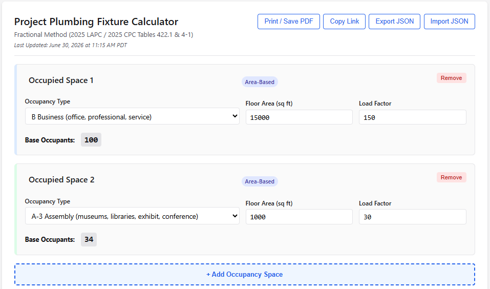
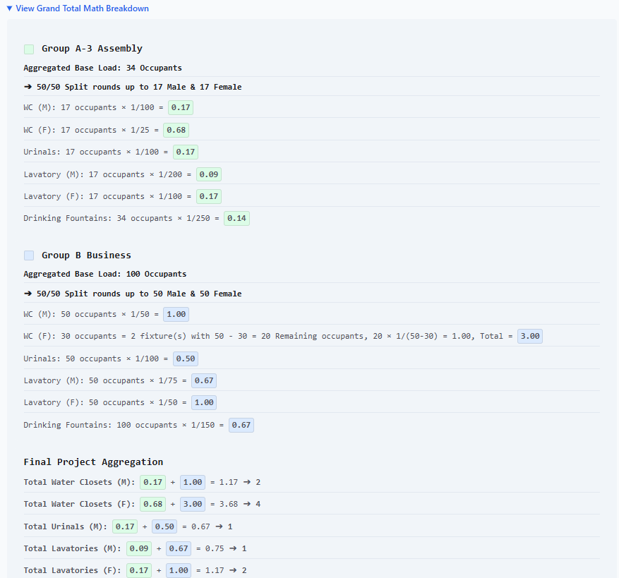
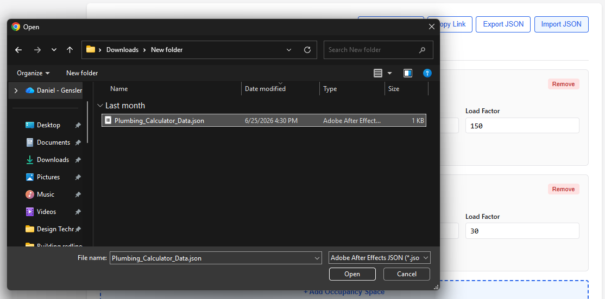

# LAPC Calculator

Welcome to the **LAPC Calculator**, a tool designed to streamline plumbing fixture calculations based on the Los Angeles Plumbing Code (LAPC) and California Plumbing Code (CPC). This application allows users to manage multiple occupied spaces and generate code-compliant fixture requirements using the Fractional Method. Please note the tool is meant for use only with projects that fall under Table 4-1 from LAPC. Table 4-2 is not currently supported.

## Table of Contents
* [Features](#features)
  * [Occupied Spaces Management](#occupied-spaces-management)
  * [Math Breakdown](#math-breakdown)
  * [PDF Export](#pdf-export)
  * [JSON Import and Export](#json-import-and-export)
  * [Copy Share Link](#copy-share-link)
* [Usage](#usage)
* [Jurisdictional Notice](#jurisdictional-notice)

---

## Features

### Occupied Spaces Management
Tailor your project's programming by creating, deleting, and organizing occupied spaces to match your building plans. Grand Total fixture counts are listed at the bottom of the page.
* **Create/Delete:** Add as many spaces as your project requires, or remove them.
* **Reorder:** Keep your spaces organized. Click and drag on a blank area of each section to reorder the list of spaces.

### Math Breakdown
The tool includes an expandable **Math Breakdown** section under the Project Grand Totals. This reveals the formulas and fractional math used to calculate occupant loads and male/female distributions before the final integer rounding is applied at the project total level. If you have multiple spaces listed under the same Occupancy type, it will aggregate these occupants before running calcs. You can audit the math breakdown against a manual calculation to confirm the fixture counts are correct.

### PDF Export
Generate reports for plan check submission. The Print/Save PDF button un-collapses all Math Breakdowns, strips away interactive UI elements, and formats the page for letter-sized sheets.

### JSON Import and Export
Save your work locally without the need for a database or backend server.
* **Export:** Download your current project configuration as a `.json` file for your records.
* **Import:** Upload a previously saved `.json` file to restore your project spaces, inputs, and settings.

### Copy Share Link
Collaborate by generating a custom URL. Clicking the `Copy Link` button encodes your current project configuration directly into the URL hash, allowing you to share the state of your calculator with colleagues, clients, or plan checkers.

---

## Usage
1. Click to add a new space to begin populating your building program.
2. Select the appropriate Occupancy Type from the dropdown.
3. Enter the Floor Area, Number of Seats, or Units as prompted by the specific occupancy.
4. Review the [Math Breakdown](#math-breakdown) to verify fractional outputs and code compliance.
5. Use the [Export tools](#json-import-and-export) to save your configuration or generate a [PDF report](#pdf-export) for submission.

---

## Jurisdictional Notice

> **⚠️ LADBS ONLY**
> 
> This calculator is explicitly configured for projects within the jurisdiction of the **Los Angeles Department of Building and Safety (LADBS)**. 
> 
> LADBS calculates plumbing fixture requirements using **Table 4-1 (Occupant Load Factor)** of the California Plumbing Code (CPC). This application of the code is formally dictated by the city's plan check memo, which you can review here: [LADBS Info Bulletin: Plumbing Fixtures (IB-P-BC2014-095)](https://dbs.lacity.gov/sites/default/files/efs/forms/pc17/plumbing-fixtures-ib-p-bc2014-095.pdf).
>
> **Why this matters for other California projects:**
> The State of California does *not* adopt Chapter 29 of the International Building Code (IBC)—the chapter that traditionally establishes plumbing fixture counts nationally.
>
> Instead, California defers these requirements to the CPC. Because of this omission at the state building code level, individual jurisdictions across California are left to establish their own policies for determining the base occupant load used in plumbing calculations. 
>
> While cities like Los Angeles default to CPC Table 4-1, other Authorities Having Jurisdiction (AHJs) enforce their own, often more stringent, rules. For example:
> * **San Francisco** applies its own local amendments to CPC Table 422.1 and enforces unique local overlays (such as the Drink Tap Ordinance) that strictly regulate drinking fountains and bottle fillers, altering overall fixture counts.
> * **San Diego** bypasses CPC Table 4-1 entirely in favor of its own local occupant load chart (via [Tech Bulletin PLMB 4-1, Table A](https://www.sandiego.gov/sites/default/files/dsdplmb-4-1_0.pdf)). For any occupancy use not explicitly listed in their custom table, San Diego requires calculating the plumbing occupant load using the standard architectural egress tables (CBC Table 1004.5) *multiplied by two*. 
> 
> **Always verify the required plumbing occupant load methodology with your local AHJ if you are designing outside of Los Angeles.**

---
